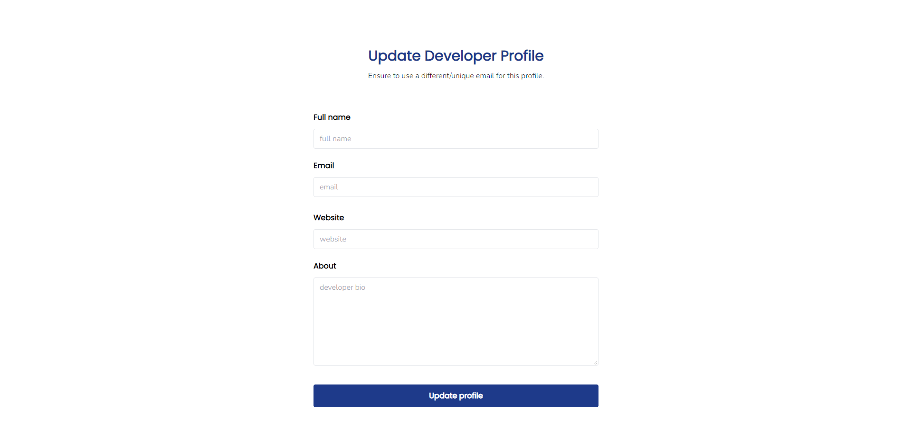

# Developer-profiles-project_youtube
This project is a super-cool project to teach developers how to build full-stack projects with the MERN stack. The project will cover 
how to build the same front-end with plain HTML, ReactJS, and NextJs. All three front-end will be styled with tailwindcss.

The project is for a Youtube MERN stack tutorial series.

## Live site

The project is live here - https://developer-profiles-project-youtube.vercel.app/

## Youtube link

You can find the Youtube tutorial of the project here - 

## Screenshot

## Tailwindcss watch command

npx tailwindcss -i ./styles/src/main.css -o ./styles/dist/main-output.css --watch
